# 🐾 VETO-EXPRESS

**VETO-EXPRESS** is a mobile and web platform that connects pet owners with veterinarians and veterinary product stores.  
It allows users to **book veterinary consultations**, **purchase animal products**, and **manage their shopping cart** directly from the app.

---

## 🚀 Features

- 📅 Book appointments with veterinarians  
- 🛒 Browse and purchase veterinary products (animal food, medicines, accessories, etc.)  
- 🔎 Search and filter products by type  
- 🧺 Add products to cart and manage quantities  
- 👨‍⚕️ Connect with veterinarians for online/offline consultations  
- 🔐 Secure authentication with JWT tokens  

---

## 📱 Screenshots

<p align="center">
  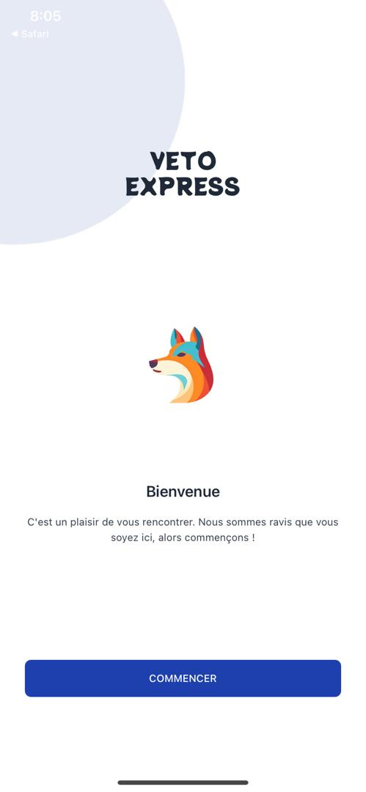
  
  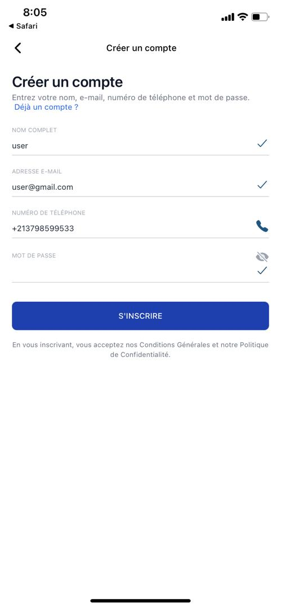
  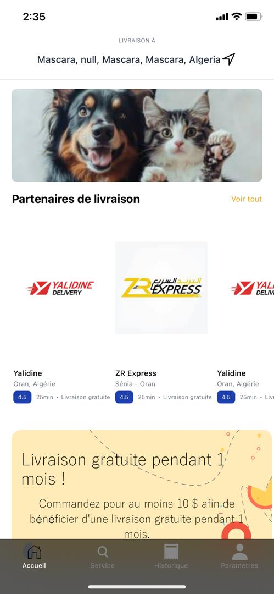
  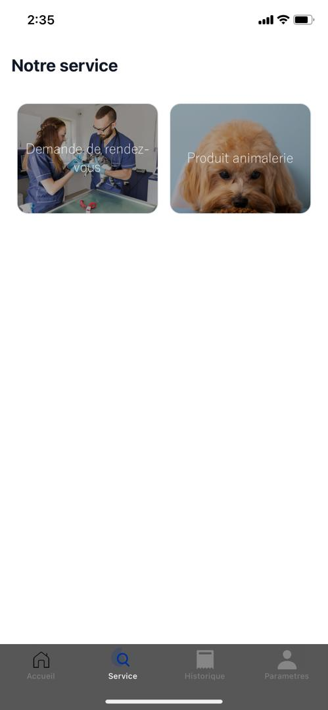
  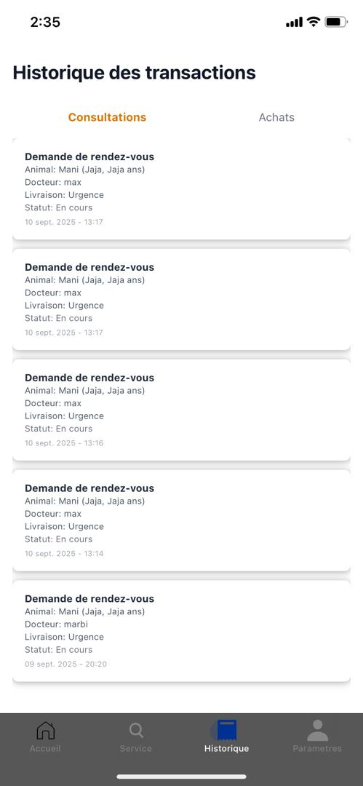
  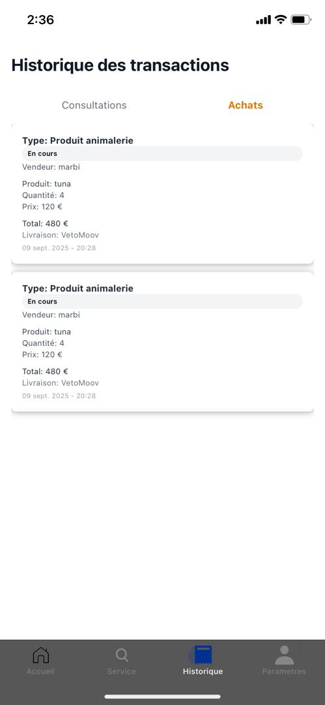
  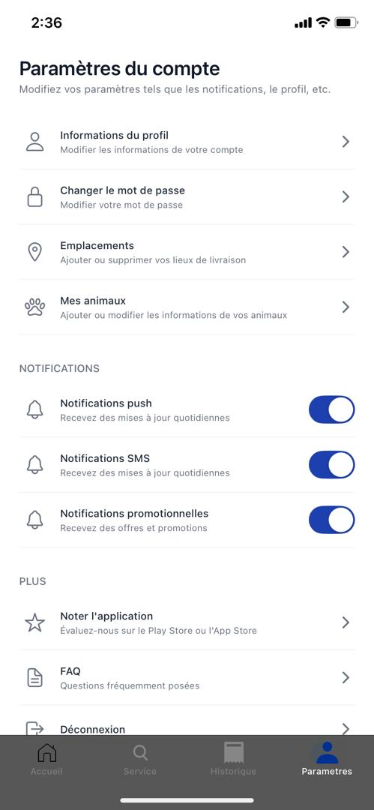
  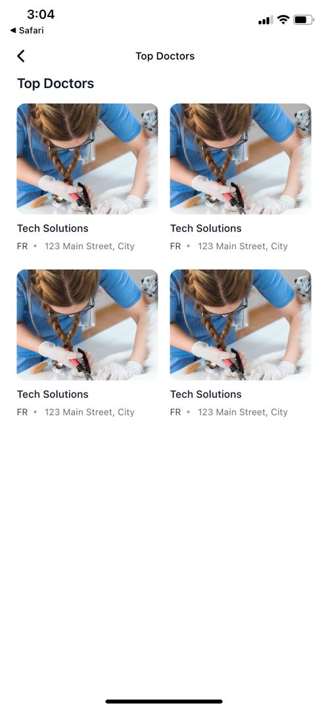
  

  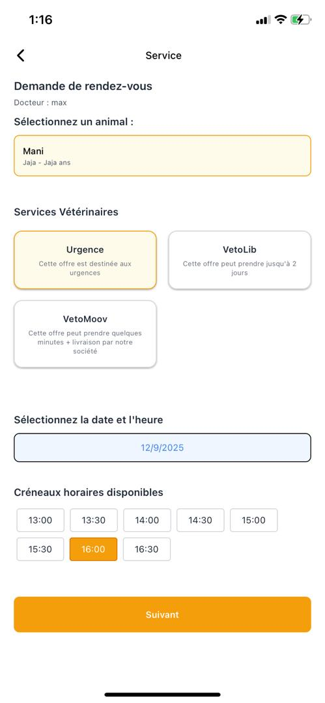
  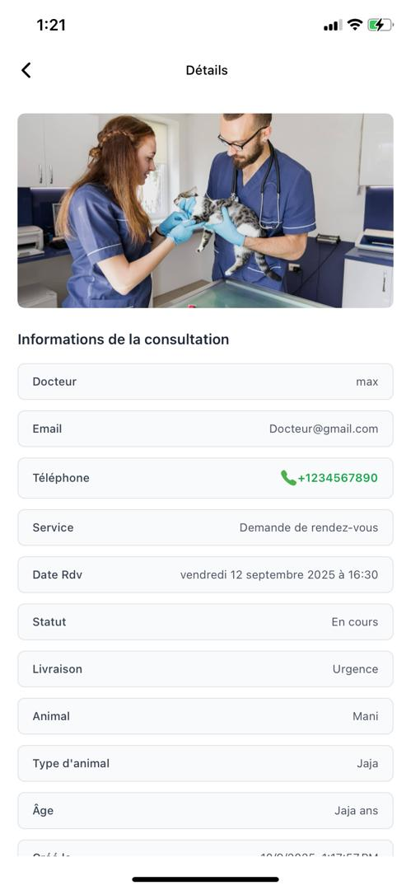
  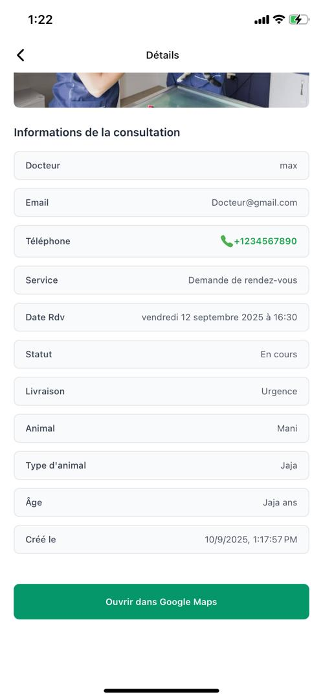
  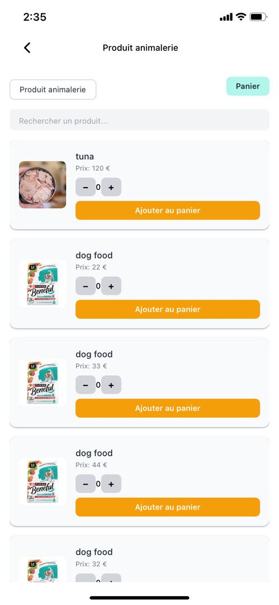
  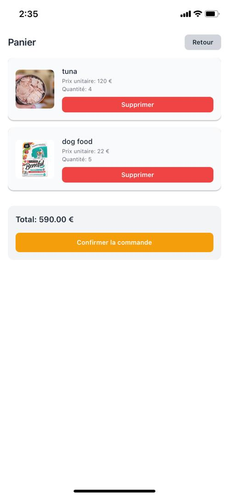
  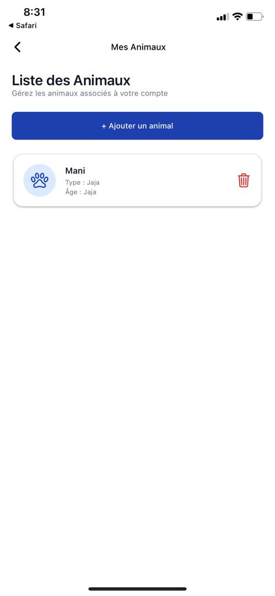

</p>

> 👉 Place your screenshots in `assets/screenshots/` folder and update the file names above.

---

## 🛠️ Tech Stack

- **Frontend (Mobile & Web):** React Native + Expo + NativeWind  
- **Backend:** Express.js / Node.js  
- **Database:** Mysql  
- **Auth:** JWT  

---

## ⚙️ Installation

### 1️⃣ Clone the repository
```bash
git clone https://github.com/la26092002/VETO-EXPRESS.git
cd veto-express
